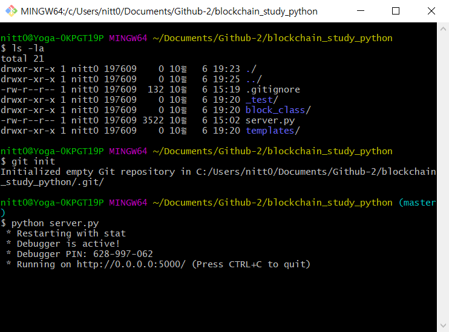
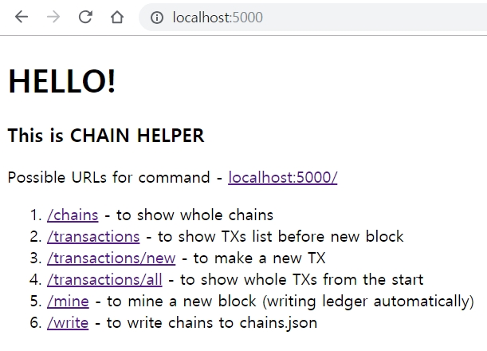
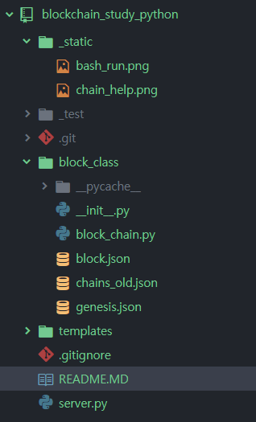
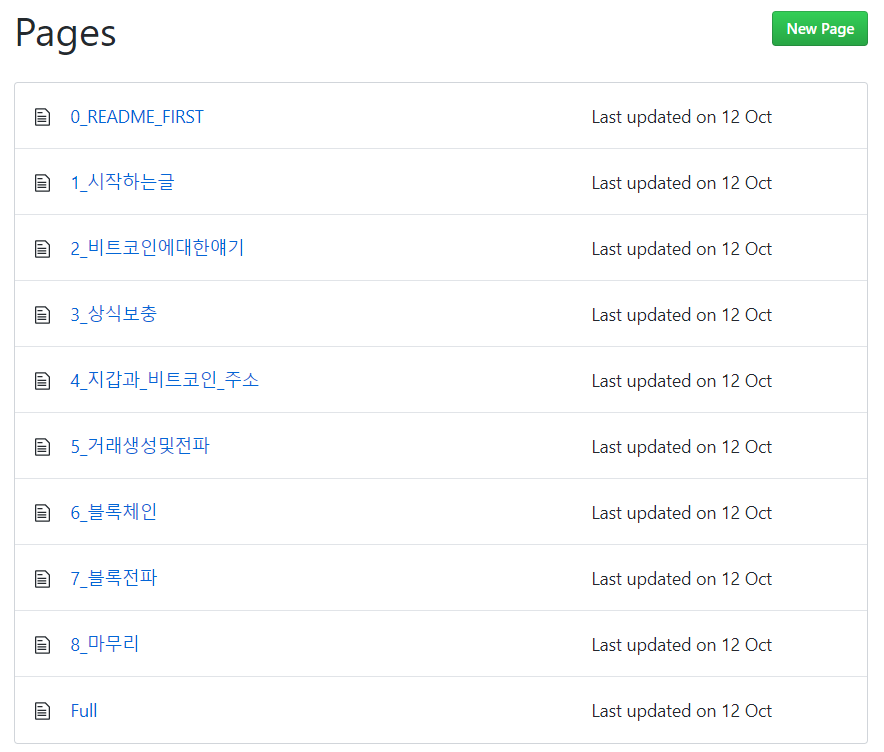

  
### 0. INTRO. 👋

This is not for project, but for the own personal study, the better understanding how blockchain work in simple way.
Thus, please just refer to it as one of many sample materials.

  
### 1. HOW TO RUN

Run bash window on the target folder and type in 'python server.py'. Then the first block, index 1, will be automatically generated if there is no stored history file named **chain.json**.

regarding **chain.json** file, there's no chain.json at the beginning. it is generated only if you like to. (I prepare 'write' menu on webpage)

When the '**chain.json**', a written history file, exists, the block history will be restored autonomously. To avoid at first, I changed the file name to '**chain_old.json**', which has the several depth of block history. you can also refer to it how block is constructed.

  
### 2. HOW IT SHOWS

> 'http://localhost:5000' in browser

  
### 3. ABOUT JSON
In block_class, there're 3 json files.

> 1. **blcok.json** - the first intention, but too many hashes
> 2. **chains_old.json** - already described on the top (ready-made history file.)
> 3. **genesis.json** - Ethereum genesis block format, just refer to it

 
<pre>
{
  "sender": "0",
  "recipient": "17460cdf96bc403ca792bf08a7f87d4d",
  "amount": 100
}
</pre>
  
This is not exact as it can be, but just alludes coinbase transaction. Because it is compensation for mining, sender is nobody, recipient is randomly generated node ID and amount is set as 100, form of variable for mining reward.

  
### 4. OTHERS
> As a beginner trying to bite a little dent on learning the blockchain technology, other constructive opinoins are always welcomed and let's make it together! 😏

  
### 5. REFERENCES
> 1. 블록체인 구현 (블록생성, 트랜잭션, 작업증명, 마이닝) -  https://goo.gl/M6XU5v
> 1. 파이썬으로 블록체인 개발 ( 아직 Part1밖에 없음) : https://goo.gl/V2owrp

  
### 6. BitCoin Wiki
> 1. [0_README_FIRST](https://goo.gl/DV8Gpq) :  please read this first.
> 1. This is originally written by [[iwanhae]](<https://git.iwanhae.ga/wan/introduction_of_bitcoin>), but the server is kind of unstable
> 1. I quote all of contents from above, please refer to this Wiki for better understanding about bit-coin mechanism.

